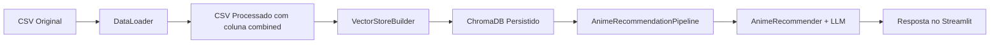
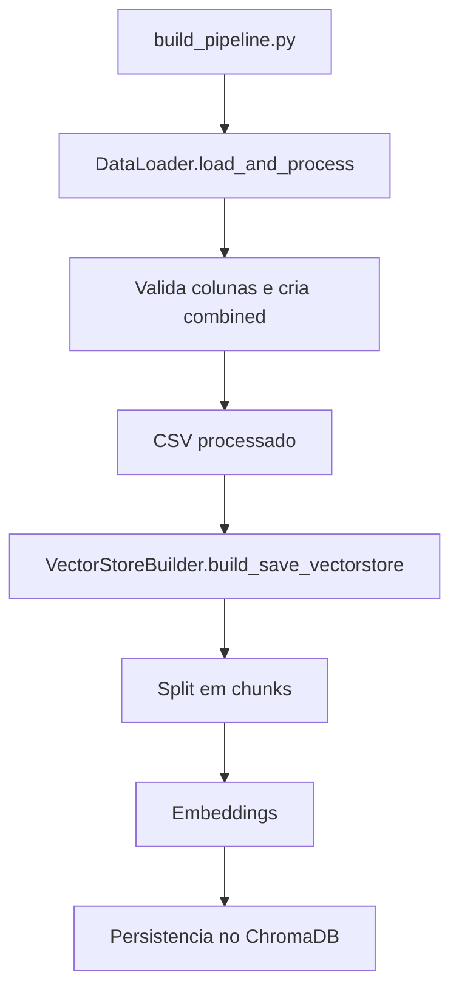
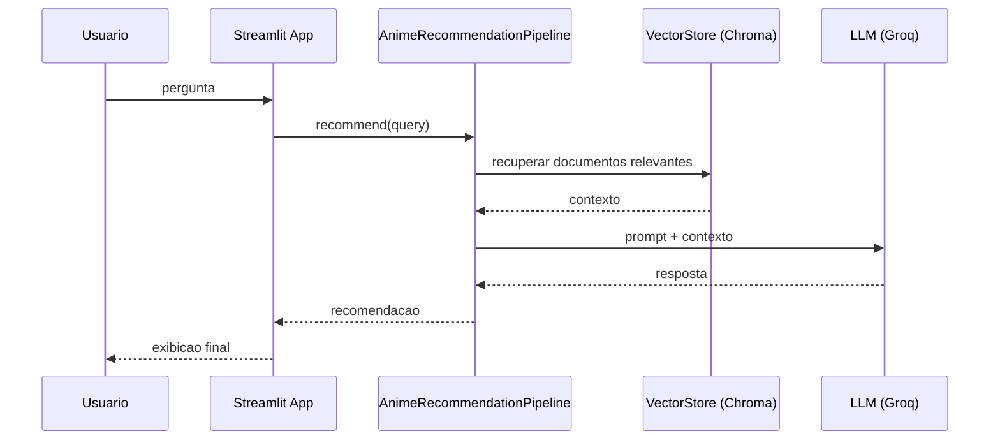

# Anime Recommender

Sistema de recomendacao de animes baseado em recuperacao vetorial (RAG) e um LLM.
O fluxo e dividido em duas etapas principais:
1) **Build do pipeline**: prepara os dados e cria o indice vetorial.
2) **Recomendacao**: carrega o indice e responde consultas do usuario via app Streamlit.

## Visao Geral

Este projeto:
- Carrega um CSV de animes com titulo, generos e sinopse.
- Gera um texto combinado para cada anime.
- Cria embeddings e persiste um indice no ChromaDB.
- Usa o indice para recuperar contexto e gerar recomendacoes com um LLM.

## Arquitetura



## Fluxo de Build



## Fluxo de Recomendacao



## Estrutura do Projeto

```
app/
  app.py                 # Interface Streamlit
config/
  config.py              # Variaveis de configuracao
data/
  anime_with_synopsis.csv
  anime_updated.csv      # Gerado pelo build
pipeline/
  build_pipeline.py      # Etapa offline (build)
  pipeline.py            # Etapa online (runtime)
src/
  data_loader.py
  vector_store.py
  recommender.py
  prompt_template.py
utils/
  custom_exception.py
  logger.py
```

## Variaveis de Ambiente

Crie um arquivo `.env` na raiz do projeto com:

```
GROQ_API_KEY=SEU_TOKEN_AQUI
```

## Instalacao

```
pip install -r requirements.txt
```

## Build do Pipeline

Gera o CSV processado e o indice vetorial:

```
python3 pipeline/build_pipeline.py
```

## Executar o App

```
streamlit run app/app.py
```

## Observacoes Importantes

- O build deve ser executado antes do app.
- Se o CSV tiver a coluna `sypnopsis` (grafia incorreta), o loader faz a correcao automatica.
- O indice e persistido no diretorio configurado no `VectorStoreBuilder`.

## Troubleshooting Rapido

- **ModuleNotFoundError**: rode `pip install -r requirements.txt`.
- **GROQ_API_KEY ausente**: verifique o `.env`.
- **Colunas ausentes no CSV**: garanta `Name`, `Genres` e `Synopsis`.
